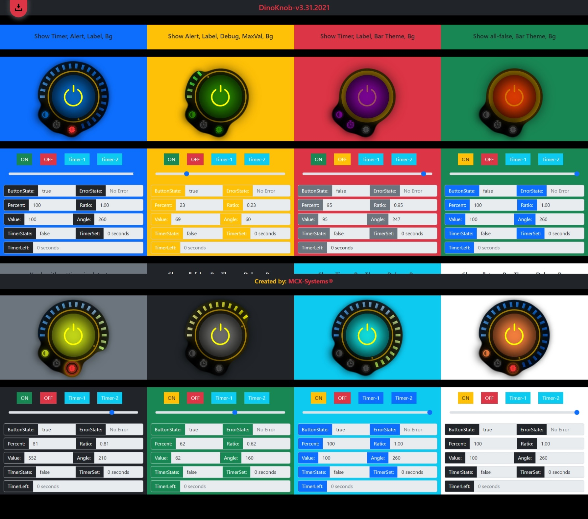

# DinoKnob

Knob/Dial Control and Power Button with mouse, wheel, touch and keyboard (← ↑ → ↓ ) support.

## Example Page
Live example page: [https://mcx-systems.net/DinoKnob](https://mcx-systems.net/DinoKnob/)




## Supported Browser
DinoKnob as generated in examples/index.html \
Tested in latest Edge, Chrome, Firefox, Opera, Safari and Mobile Safari \

- Canvas-based, no image files required.
- Mouse, wheel, touch and keyboard controls.

Based on [https://github.com/tutorialzine/KnobKnob](https://github.com/tutorialzine/KnobKnob) \
Thank You ...

Example for dinoKnob control
------------------------

```script
$(document).ready(function()
{
	$('#KnobTest1').dinoKnob({
		// Theme Light or Dark
		theme: 'dark',
		// Step Value of the Knob
		snap: 5,
		// Knob Display Max Value as 100%
		maxValue: 100,
		// Max angle value, for alarm icon
		maxAlarm: 200,
		// Circle Bar style Hot, Cold or Mono, yellow, blue, red, green
		barStyle: 'blue',
		// Enable Timer Button
		showTimer: true,
		// Enable Alerts Button
		showAlert: true,
		// Enable Labels Button
		showLabel: true,
		// Event on knob turn - change
		onTurn: function(dinoId, percent, degree, ratio)
		{
			console.log(dinoId + ' ==> ' + percent);
			console.log(dinoId + ' ==> ' + degree);
			console.log(dinoId + ' ==> ' + ratio);

			$("#per1").val(percent);
			$("#des1").val(degree);
			$("#rat1").val(ratio);
		},
		onComplete: function(dinoId, state, timerState)
		{
			// Return Button State true or false
			console.log(dinoId + ' ==> BUTTON ==> ' + state);
			console.log(dinoId + ' ==> TIMER ==> ' + timerState);
			$("#sta1").val(state);
			$("#stu1").val(timerState);
		}
	});

	// Depends on maxAngle, set to max of 255 default
	$("#KnobTest1 input[type=checkbox]").prop('checked', true).trigger('change');
	$("#KnobTest1 input[type=hidden]").val(255).trigger('change');
	//$('#KnobTest1').data('plugin_dinoKnob').destroy();
});
```

You may update both the maxAngle value \
(`$("#KnobTest1 input[type=hidden]").val(255).trigger('change');`) \
and the button state value \
(`$("#KnobTest1 input[type=checkbox]").prop('checked', true).trigger('change')`) \
programmatically in your script to display new values.

Properties
----------

- `snap`: 
- `minValue`: 
- `maxValue`: 
- `maxAngle`: 
- `theme`: 
- `barStyle`: 
- `onComplete`: 
- `onTurn`: 

Return values from example
----------

- `state`: 
- `percent`: 
- `degree`:
- `ratio`: 
